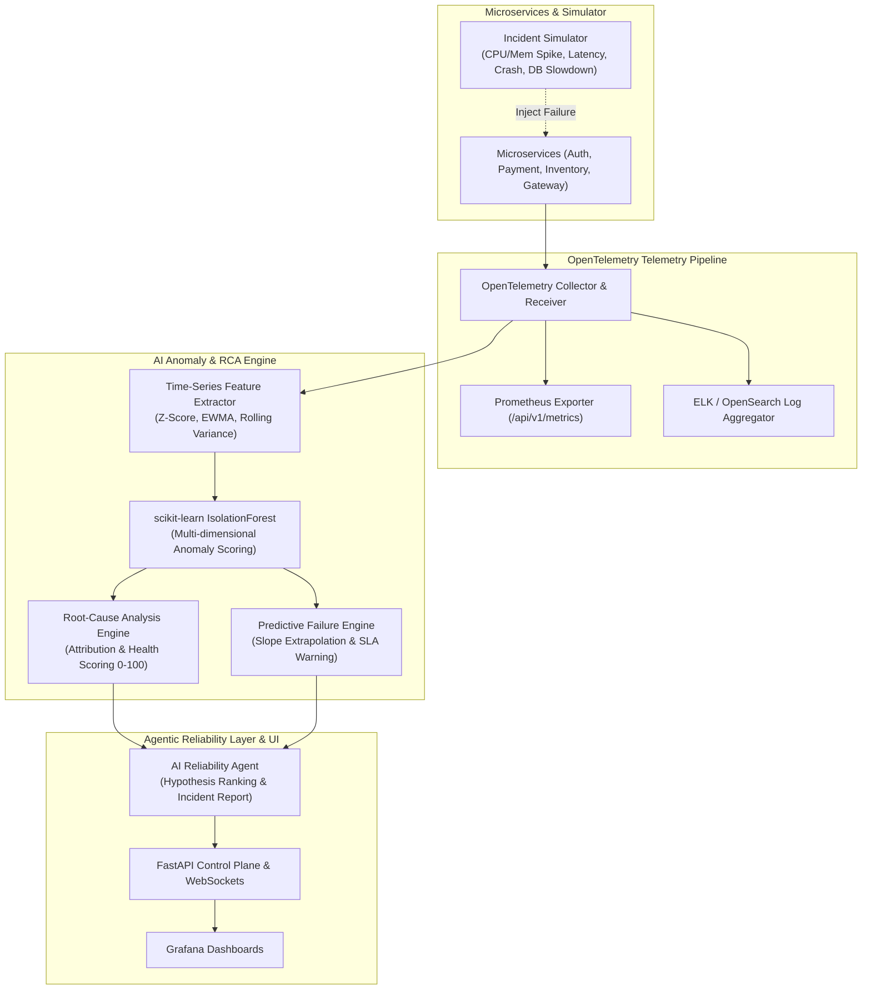

# Intelligent Cloud Observability Platform (`intelligent-cloud-observability-platform`)

[](https://www.python.org/downloads/release/python-3120/)
[](https://github.com/shamddd/intelligent-cloud-observability-platform/actions/workflows/ci.yml)
[](LICENSE)
[](Dockerfile)

> An AI-powered cloud observability platform featuring real-time OpenTelemetry metric ingestion, scikit-learn IsolationForest anomaly detection, automated root-cause analysis (RCA), predictive failure forecasting, an incident simulation engine, and an AI Infrastructure Reliability Agent.

---

## Why This Project Exists

Modern microservice architectures generate massive volumes of metrics, logs, and distributed traces. Traditional threshold-based alerts fail under complex cascade failures and high metric noise. This platform delivers intelligent, multi-dimensional observability by executing `scikit-learn` anomaly detection models, ranking suspect root causes, forecasting SLA resource exhaustion, and deploying an AI Reliability Agent to diagnose operational incidents.

---

## Architecture



---

## Key Features

- **scikit-learn Anomaly Detection Engine**: Unsupervised `IsolationForest` model trained on multi-dimensional metric vectors (CPU, Memory, Latency, Error Rate).
- **Automated Root-Cause Analysis (RCA)**: Ranks microservices and calculates metric feature attribution scores (`z-score` contribution percentages).
- **Predictive Failure Forecasting**: Linear regression slope trend extrapolation forecasting time-to-resource-exhaustion before SLA breaches occur.
- **Incident Simulation Engine**: Injects 6 operational failure modes (`CPU_SPIKE`, `MEMORY_SPIKE`, `LATENCY_INCREASE`, `SERVICE_CRASH`, `DEPENDENCY_FAILURE`, `DATABASE_SLOWDOWN`).
- **AI Infrastructure Reliability Agent**: Controlled state-machine agent observing anomalies, inspecting error logs/spans, ranking hypotheses, and generating markdown incident reports.
- **OpenTelemetry & Prometheus Integration**: Standard OpenTelemetry collector pipeline exporting `/api/v1/metrics` in Prometheus text format.

---

## Technology Stack

- **Core & AI**: Python 3.12+, `scikit-learn`, `numpy`, Pydantic v2
- **Telemetry**: OpenTelemetry SDK, Prometheus Client
- **Control Plane**: FastAPI, Uvicorn, WebSockets, Starlette
- **Visualization**: Grafana Provisioned Dashboards JSON
- **CI/CD & Containers**: Docker, Docker Compose, GitHub Actions

---

## Quick Start

### Setup & Run Tests

```bash
# Clone repository
git clone https://github.com/shamddd/intelligent-cloud-observability-platform.git
cd intelligent-cloud-observability-platform

# Install dependencies via uv
pip install uv
uv sync --extra dev

# Run unit and integration tests
uv run pytest
```

### Running with Docker

```bash
docker compose up --build
```

---

## Demo Experience

Run the interactive incident simulation and AI Agent diagnosis demo:

```bash
python scripts/run_incident_demo.py
```

### Example Demo Output

```text
======================================================================
  INTELLIGENT CLOUD OBSERVABILITY PLATFORM — INCIDENT DEMO
======================================================================

[Step 1] Initializing Healthy Telemetry Baseline for 4 Microservices...
  Cluster Health Score: 100.0/100.0 (Status: HEALTHY)

[Step 2] Injecting Incident Scenario: CPU_SPIKE on 'payment-service'...
  IsolationForest Anomaly Score: -0.1245 (Confidence: 62.45%)
  Service Health Status: CRITICAL (24.0/100.0)
  Root Cause Metric Attribution: CPU_UTILIZATION (Z-Score: 4.85, Contribution: 78.4%)

[Step 3] Injecting Incident Scenario: DATABASE_SLOWDOWN on 'auth-service'...
  Predictive SLA Failure Risk: SEVERE
  Current Latency: 1850.0 ms -> Projected 5m Latency: 4500.0 ms

[Step 4] Invoking Autonomous AI Reliability Agent for Incident Diagnosis...
# Incident Diagnosis Report: inc-8a12f94b
**Target Service**: `payment-service`  
**Severity**: `CRITICAL`  
**Health Score**: `24.0/100.0` (CRITICAL)  
**Anomaly Confidence**: `62.45%`  

## Root Cause Summary
CRITICAL state on payment-service: top contributor CPU_UTILIZATION

## Diagnostic Hypotheses
- Hypothesis 1 (High Confidence): CPU saturation caused by inefficient process loop or high compute load

## Recommended Remediations (Human Approval Required)
- **[rem-1a2b]** Scale out horizontal pod count for service payment-service *(Impact: Increas compute capacity)*
```

---

## API Endpoints

- `GET /api/v1/health`: Overall cluster health status and score.
- `GET /api/v1/metrics`: Prometheus exposition metrics format.
- `POST /api/v1/incidents/simulate`: Trigger failure scenarios.
- `DELETE /api/v1/incidents/simulate/{service_name}`: Clear failure scenarios.
- `GET /api/v1/analysis/rca`: Ranked Root-Cause Analysis report.
- `POST /api/v1/agent/diagnose`: Invoke AI Reliability Agent diagnosis.
- `WS /api/v1/ws/stream`: Real-time WebSocket telemetry stream.

---

## Project Structure

```text
intelligent-cloud-observability-platform/
├── src/icop/
│   ├── agent/                        # AI Reliability Agent & Tools
│   ├── api/                          # FastAPI REST API & WebSockets
│   ├── ml/                           # IsolationForest ML & RCA Engine
│   ├── simulator/                    # Fault Injection Engine
│   └── telemetry/                    # OpenTelemetry & Prometheus Pipeline
├── tests/                            # Pytest Integration Suite
├── scripts/                          # Demo Scripts
├── grafana/                          # Grafana Dashboard Definitions
├── .github/workflows/                # CI Pipeline
├── Dockerfile                        # Multi-stage Container
└── README.md
```

---

## Author

**Sham Satish Thakare**  
GitHub: [https://github.com/shamddd](https://github.com/shamddd)
