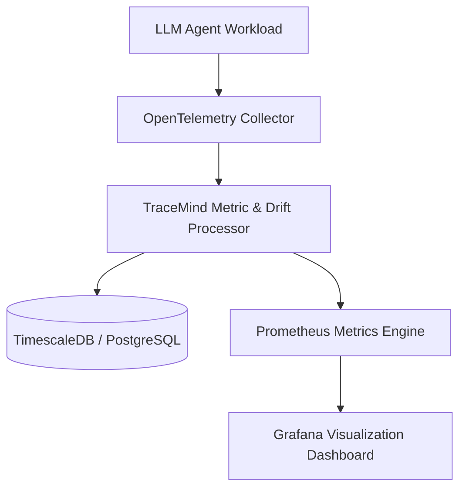

# TraceMind System Architecture

## 1. System Overview
`tracemind` is an open-source LLM agent observability and distributed tracing platform built on OpenTelemetry, FastAPI, and Grafana.

## 2. Key Services
- **Telemetry Ingestion Engine:** OpenTelemetry collector endpoint for agent token metrics, prompt history, and execution spans.
- **Prompt Drift Tracker:** Evaluates embedding variance and output semantic drift across agent execution steps.
- **FastAPI Control Plane:** REST API managing tracing credentials, workspace configurations, and export pipelines.
